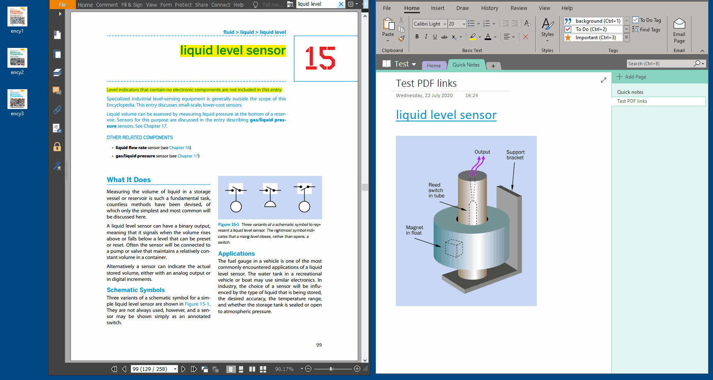

# A short vbscript PDF handler to open pdfs on a certain page

I use this pdf handler to open pdfs on my local disk from onenote.
The only added feature it has above the normal click is that it
goes directly to a certain page.

## Usage:

The pdf URLs are in the form of shortfilename + pagenum like:

 `pdf://shortfilename:40`

- there is NO pdf extension needed for `shortfilename`, this is to keep the 
  url short.
- advise: if you need to type the url a lot, try renaming your file to
  something short like: 'Very Long Book Title.pdf', 'vlbt.pdf'
- if you create a link of a picture, you need to use <kbd>ctrl</kbd>+click, 
  with normal text you can just click.

## Installing

  - download .vbs script and put it somewhere on your pc (eg. Documents/)
  - change PdfDir in this script to where your pdfs are located
  - change PdfExe to either Foxit or PDF-Xchange (others won't work)
  - download .reg file 
  - change location of command in registry file to where you put the
  .vbs file
  - execute reg file or add commands manually
  - for onenote optionally disable warnings [warnings](https://superuser.com/questions/1307645/how-to-disable-hyperlink-security-notice-in-onenote-2016)

## For developers

   - i've never used vbs before but:
       - python: could not let me open files in the same tab using Popen
       - powershell: shows/flashes a short console window which you can not get rid of [#3028](https://github.com/PowerShell/PowerShell/issues/3028)
       - vbscript: works and is installed by default on win10

  - regarding pdf readers these are the only ones that work by actually
    changing the page in the _current_ tab. almost all others will open a
    new tab or window even if the file is already open (eg. acrobatreader)

# DISCLAIMER:

   - if someone sends you a pdf:// link and bad things happen, then welcome
     to the nineties...
